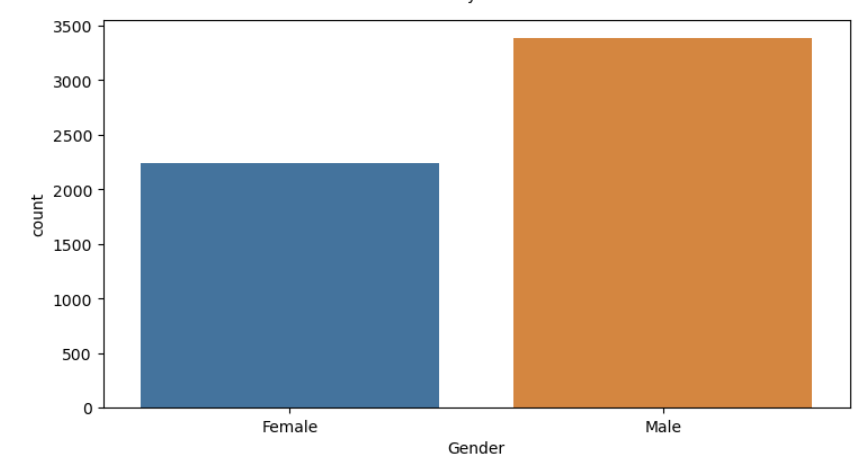
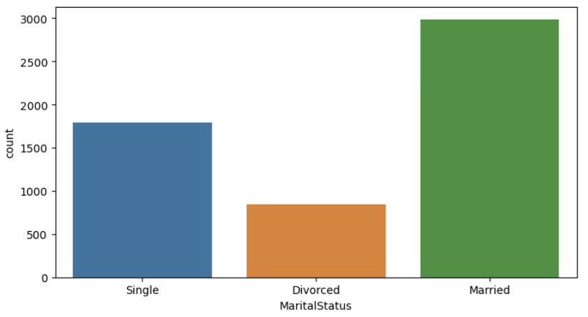
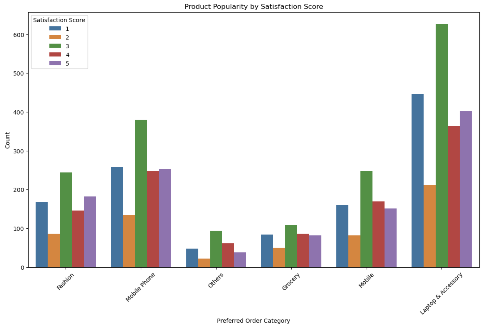

+++
title = 'Analyzing E-Commerce Customer Behaviour and Churn'
date = 2024-07-20T13:00:38-04:00
draft = false
+++

In this post, I explore and analyze some e-commerce customer data by identifying patterns in customer satisfaction and churn. 

The dataset used for this analysis includes information on customer demographics, purchasing behavior, and satisfaction scores. Key features include:

* CustomerID     
Unique identifier for each customer.
* Gender  
Gender of the customer (Male/Female).
* MaritalStatus  
Marital status of the customer (Married/Single/Divorced).
* PreferedOrderCat    
Preferred order category of the customer (e.g., Fashion, Grocery, Mobile).
* SatisfactionScore    
Satisfaction score given by the customer (1 to 5).  
* Complain    
Whether the customer has made a complaint (Yes/No).  
* Churn    
Whether the customer has churned (0 for no, 1 for yes).

## Key Analyses and Insights
### Who are the customers?
I start off by getting the gender and marital status distribution and found:  
Male: 3384  
Female: 2246

Married: 2986  
Single: 1796  
Divorced: 848  

The customer base is predominantly male, with males making up 60% and females 40% of the total customer population.

### Discovering Preferred Order Categories
I examine customer preferences by analyzing preferred order categories

Categories like "Mobile Phone" and "Laptop & Accessory" have the highest satisfaction scores, indicating that these product categories are highly favored by customers.

I also explore the relationship between marital status and preferred order categories to understand how different demographic groups shop.

### General Observations  
Dominance of Married Customers:  
Across all product categories, married customers consistently show higher numbers compared to single and divorced customers. This indicates that married individuals might have a higher purchasing power or different shopping needs compared to other groups.

Single Customers:  
Single customers generally follow married customers in numbers, with a considerable gap in categories like Laptop & Accessory and Mobile.

Divorced Customers:  
Divorced customers consistently form the smallest group in all categories. This might reflect different shopping habits or economic conditions impacting their purchasing behavior.

