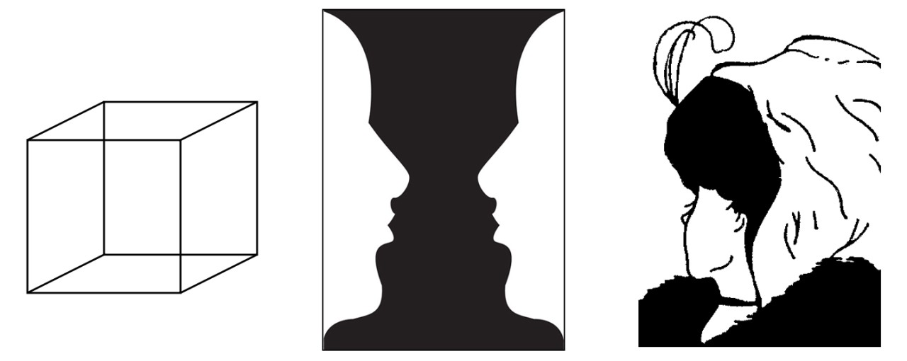

+++
title = 'ChatGPT vs Claude: Ambiguity Resolution (Part I)'
date = 2024-05-28T12:12:38-04:00
draft = false
+++

>*"One morning I shot an elephant in my pajamas." -- Groucho Marx*

Syntactic ambiguities occur when a sentence can have multiple meanings. For example, consider the sentence from the famous Groucho Marx joke above. This sentence is ambiguous because it's unclear whether the elephant was in pajamas or Groucho Marx was in pajamas while shooting the elephant. If you're curious which interpretation Groucho Marx meant, here is the full quote: *"One morning I shot an elephant in my pajamas. How he got into my pajamas I’ll never know."*

It's easy enough for a human being to understand the two interpretations, and thanks to common sense or when given more context, it's possible to disambiguate the phrase. On the other hand, chatbots and even the latest large language models (LLMs) struggle with these types ambiguous inputs. Here are two reasons: (1) LLMs aren't trained to handle very ambiguous inputs well; (2) the ambiguity level can vary depending on the LLMs' knowledge, making it difficult to investigate. 

I'm currently working on an experiment where I look at *temporary syntactic ambiguities* which occur when the beginning of a sentence can have multiple meanings. I investigate how LLMs generate sentence completions after being fed ambiguous partial sentences. 

I was initially inspired by [this paper](https://arxiv.org/abs/2109.07848) where the researchers look at whether language models show uncertainty when processing ambiguous sentences and how this uncertainty changes with context clues. They generate multiple sentence completions from the LMs (GPT-2 and an LSTM), analyze them, and measure the probability the LMs assign to different interpretations. The findings suggest that LMs can keep track of multiple possible analyses at once, and while they often pick the correct interpretation when given clues, they still make mistakes, which means there is room for improvement.

In contrast to the above experiment, I investigate how the latest LLMs - GPT and Claude, generate sentence completions from ambiguous partial sentences. The types of sentence completions that I focused on were Noun Phrases (NP) and Sentential Complements (S). 

## Methods
### NP/S Ambiguity
I use 20 NP/S temporary ambiguous sentence portions from Grodner et al. (2003) and 20 unique ones that I created, all of which have a NP and S interpretation. Each sentence portion is passed to the LLMs as input for generation.

The definitions of NP and S are as follows:
A noun phrase (NP) functions as a subject or object within a sentence, usually consisting of a noun and modifiers, whereas a sentential complement (S) is a clause (a subject and predicate) that complements the main verb, often expressing what is understood, believed, heard, etc.

### LLMs
I evaluate two large language models: GPT3.5-turbo and Claude3-haiku.

### Generation
For experimental consistency, I used the same prompt, temperature, and maximum amount of tokens for both LLMs in the API calls. A temperature of 0.7 was used which was found to be the right amount for generating creative output that also remained realistic. I generate 40 completions, one for each ambiguous sentence portion.

### Classification
For this method, manual classification of NP/S was required as it is more reliable than the automated classification that was attempted but was not as successful. To classify a completion as a case of an NP or an S, I inspect the dependency label of the locus of ambiguity (direct object → NP; subject → S). Some of the completions formed a complex NP (e.g., a modifier of another noun), which were also labeled as NP. 

Below is an example of a partial sentence and the corresponding NP and S completion that could be generated.


These are examples of completions generated by both models:

### Conclusion
The results indicate that on average, Claude generates 60% more sentential complements than GPT. The bar chart shows that Claude generates almost half as many S completions as it generates NP completions compared to GPT that generates mostly NP completions. NP completions are more common for both models, possibly because they are structurally simpler than S and are less complex for LLMs to generate. As a next step, it would be interesting to compare this ratio of counts to public corpora such as Wikipedia.



